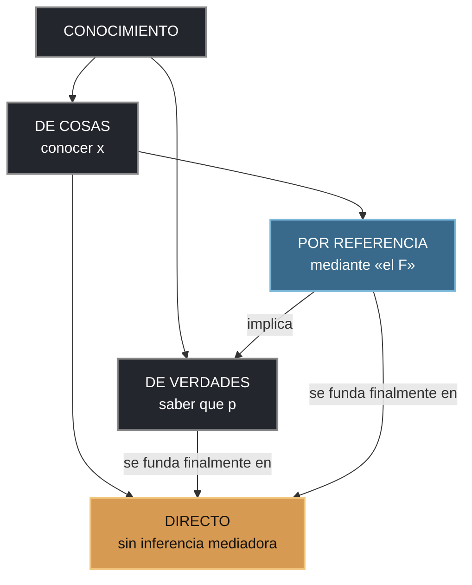
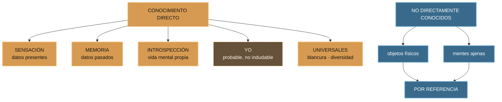
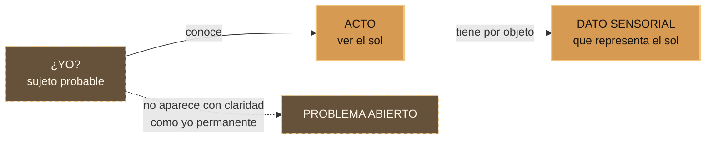
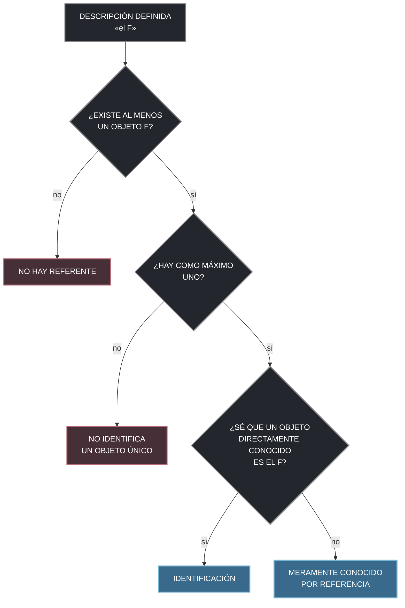
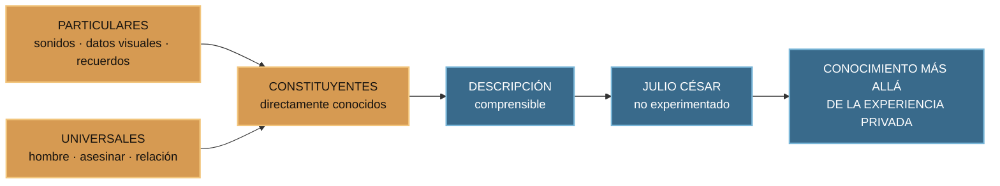
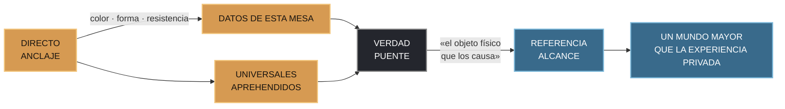

# La arquitectura de lo ausente

## Cómo una experiencia diminuta puede abrirnos un mundo inmenso

> **Pregunta de apertura:** toca una mesa. ¿Conoces el objeto físico o conoces color, forma, dureza y resistencia?

La exposición comienza con una mesa presente y termina en Julio César, Bismarck y personas cuya identidad ignoramos. Ese desplazamiento es el arco del capítulo 5: Bertrand Russell parte de lo que se presenta **sin inferencia** y muestra cómo las verdades y las descripciones permiten pensar con sentido en lo que jamás hemos experimentado.

La tesis puede memorizarse en dos palabras:

> **PARÁFRASIS RECTORA:** directo = anclaje. Referencia = alcance.

No son dos mundos rivales. El conocimiento directo aporta los elementos con los que pensamos; el conocimiento por referencia los organiza para alcanzar objetos ausentes. La fuerza del capítulo está precisamente en su dependencia: la referencia amplía la experiencia porque se apoya en ella.

---

## 1. Contrato de esta exposición

| Elemento | Decisión |
|---|---|
| Texto base | Bertrand Russell, *Los problemas de la filosofía*, capítulo 5 |
| Edición | Editorial Labor, 1995; traducción de Joaquín Xirau |
| Pregunta dramática | ¿Cómo conocemos algo que no se presenta directamente? |
| Tesis | Toda proposición comprensible se compone de elementos directamente conocidos; las descripciones extienden el alcance del pensamiento |
| Estructura | Tres actos: **presencia → distancia → alcance** |
| Duración | 27:15 min de guion; margen natural hasta 30 min |
| Diapositivas | 14, sincronizadas con la presentación web |
| Diagramas | 8 diagramas Mermaid más los visuales interactivos de la web |

### Resultado de aprendizaje

Al final, el público debe poder responder cinco preguntas:

1. ¿Qué diferencia hay entre conocer una cosa y conocer verdades sobre ella?
2. ¿Por qué los datos sensoriales son directos y la mesa física es conocida por referencia?
3. ¿Qué incluye Russell entre los objetos directamente conocidos?
4. ¿Cómo puede una descripción identificar un objeto que no conocemos directamente?
5. ¿Por qué podemos hablar de Julio César sin tenerlo presente en el pensamiento?

### Regla escénica

Cada diapositiva realiza una sola tarea. La pantalla formula el golpe conceptual; este documento contiene la explicación, el ejemplo, la cautela y la frase de transición. No conviene leer la pantalla: hay que **contar el recorrido**.

### Navegación rápida

- [Mapa sincronizado de las 14 diapositivas](#mapa-sincronizado)
- [Acto I · Presencia](#acto-i)
- [Acto II · Distancia](#acto-ii)
- [Acto III · Alcance](#acto-iii)
- [Matriz conceptual](#matriz-conceptual)
- [Objeciones para el coloquio](#objeciones)
- [Preguntas para el público](#preguntas)
- [Glosario mínimo](#glosario)

### Convenciones editoriales

- **CITA:** texto literal de Russell entre comillas, acompañado por página cuando sostiene un paso central.
- **PARÁFRASIS:** reconstrucción del argumento con vocabulario pedagógico; constituye la voz principal del guion.
- **EXTENSIÓN PEDAGÓGICA:** notación, ejemplo, objeción o fórmula añadida para enseñar; nunca se atribuye al capítulo.

Estas etiquetas separan la evidencia textual de la explicación y de nuestros recursos expositivos.

---

## 2. El arco dramático en tres actos

| Etapa | Diapositivas | Pregunta | Descubrimiento |
|---|---:|---|---|
| Preludio | 1–2 | ¿Qué conozco cuando toco una mesa? | La pregunta que organiza el recorrido |
| I · Presencia | 3–8 | ¿Qué está realmente ante la mente? | Datos sensoriales, memoria, introspección y universales pueden conocerse directamente |
| II · Distancia | 9–11 | ¿Cómo identificamos lo que no se presenta? | Una descripción definida permite saber que existe un único referente sin saber cuál es |
| III · Alcance | 12–14 | ¿Cómo puede el pensamiento tratar sobre lo ausente? | Las proposiciones se componen de elementos directamente conocidos y alcanzan objetos nunca experimentados |

El recorrido causal de la mesa tiene una forma precisa:

> **Presencia → verdad puente → descripción → referente ausente.**

En otros casos, el paso puede depender de distintas **verdades de enlace**. La mesa recorre la secuencia causal; Julio César muestra hasta dónde puede ampliarse el alcance descriptivo.

---

## 3. Mapa sincronizado de las 14 diapositivas

| # | ID web | Idea en pantalla | Tiempo |
|---:|---|---|---:|
| 1 | `pregunta` | Toca la mesa. ¿Qué conoces realmente? | 1:30 |
| 2 | `portada` | La arquitectura de lo ausente | 1:00 |
| 3 | `arquitectura` | Russell abre una grieta en la palabra «conocer» | 2:00 |
| 4 | `color` | El color no depende de la frase | 2:00 |
| 5 | `mesa` | Aquí ocurre el salto | 2:30 |
| 6 | `inventario` | Lo directo es más amplio que este instante | 2:30 |
| 7 | `yo` | Encuentro pensamientos. ¿Encuentro al pensador? | 2:00 |
| 8 | `universales` | Lo más abstracto también puede ser directo | 1:45 |
| 9 | `descripcion` | La palabra «el» abre una puerta lógica | 2:00 |
| 10 | `ganador` | Conozco a cada candidato. Aún no conozco «al ganador» | 2:00 |
| 11 | `bismarck` | Un solo Bismarck. Varios caminos mentales | 2:30 |
| 12 | `principio` | «Toda proposición que podamos entender…» | 2:30 |
| 13 | `cautelas` | No todo tiene el mismo grado de compromiso | 1:30 |
| 14 | `respuesta` | La mesa no se presenta. La alcanzamos. | 1:30 |

**Tiempo total:** 27:15. Las pausas del experimento inicial, una intervención del público y las transiciones lo sitúan naturalmente entre 28 y 30 minutos.

---

# ACTO I · PRESENCIA

## Diapositiva 1 — Toca la mesa · 1:30

### En pantalla

> **Toca la mesa. ¿Qué conoces realmente?**

### Puesta en escena

No comiences diciendo «Russell distingue…». Pide diez segundos de silencio y que alguien toque una mesa, pupitre o superficie cercana.

Pregunta, despacio:

- ¿Qué ves?
- ¿Qué sientes en la mano?
- ¿Dónde está exactamente *la mesa física* entre esas respuestas?

El público probablemente nombrará color, forma, textura, frío, dureza o resistencia. Esas respuestas son correctas, pero todavía no resuelven el problema. Russell preguntaría si el objeto físico se presenta de la misma manera que esas cualidades.

### La tensión

Si respondemos «solo conozco sensaciones», parece que perdemos el mundo. Si respondemos «conozco directamente la mesa», debemos explicar por qué su presencia es tan diferente de la presencia del color.

No resuelvas todavía. Di:

> «Dejemos la mesa aquí. Regresaremos a ella cuando sepamos distinguir presencia y descripción».

### Transición exacta

> «Russell convierte esta duda cotidiana en un mapa completo de nuestro conocimiento».

---

## Diapositiva 2 — La arquitectura de lo ausente · 1:00

### En pantalla

> **Directo = anclaje · Referencia = alcance**

### Qué decir

Nuestra experiencia inmediata es extraordinariamente estrecha: este color, este sonido, este recuerdo, este pensamiento. Sin embargo, hablamos de objetos físicos, otras mentes, países que nunca visitamos y personas muertas hace siglos.

El capítulo debe explicar dos cosas a la vez:

1. por qué nuestras palabras no flotan sin anclaje en algo directamente presentado;
2. cómo ese anclaje limitado permite pensar en un mundo muchísimo mayor.

La respuesta será una arquitectura de dos niveles. El conocimiento directo **ancla** el significado. El conocimiento por referencia **amplía** lo que podemos conocer.

### Transición exacta

> «Para responder, Russell abre primero la palabra conocer».

---

## Diapositiva 3 — Russell abre una grieta en la palabra «conocer» · 2:00

### En pantalla

> **Conocer una cosa no es conocer verdades sobre ella.**

Russell recupera una distinción del capítulo anterior:

- **conocimiento de verdades:** saber que una proposición es el caso;
- **conocimiento de cosas:** estar cognitivamente relacionado con algo.

Después divide el conocimiento de cosas:

### La asimetría esencial

El conocimiento directo es «esencialmente más simple» y **lógicamente independiente** del conocimiento de verdades. Eso no quiere decir que psicológicamente experimentemos datos puros sin pensar nada acerca de ellos. Quiere decir que la inferencia no constituye esa relación.

El conocimiento por referencia, en cambio, siempre implica verdades que son su «fuente y fundamento». Para conocer por referencia la mesa necesitamos una verdad que conecte los datos sensoriales con un objeto físico.

### Error que hay que evitar

No presentar la oposición como:

- directo = verdadero;
- referencia = falso o dudoso.

Ambos pueden producir conocimiento. Se diferencian por **cómo** llega el objeto al pensamiento.

### Transición exacta

> «Veamos la diferencia antes de ponerle palabras».

---

## Diapositiva 4 — El color no depende de la frase · 2:00

### En pantalla

| Cosa presentada | Verdades sobre ella |
|---|---|
| el matiz | «es castaño» · «es oscuro» |

### Qué significa «directo»

Russell define este conocimiento como saber de algo:

> «sin el intermediario de ningún proceso de inferencia ni de ningún conocimiento de verdades».
>
> **CITA · Russell, cap. 5, p. 47.**

Cuando vemos el matiz de la mesa, el color está presente. Podemos además clasificarlo: *castaño*, *oscuro*, *más cálido que otro*. Esas frases añaden verdades **sobre** el color, pero no presentan más color. La prioridad es lógica, no necesariamente temporal: Russell advierte que sería precipitado negar que alguna verdad pueda conocerse de manera simultánea.

Russell afirma que, respecto del conocimiento del color mismo, lo conocemos:

> «de un modo perfecto y completo».
>
> **CITA · Russell, cap. 5, p. 48.**

La expresión es fuerte, pero su alcance es preciso. No significa:

- que conozcamos todas sus propiedades físicas;
- que sepamos todas las verdades acerca de él;
- que cualquier juicio posterior sea infalible.

Significa que el color, como dato presentado, no puede hacerse «más presente» mediante una inferencia. El error pertenece a los juicios que formulamos; el dato mismo todavía no es una proposición verdadera o falsa.

### Mini demostración oral

Muestra un color y pregunta: «¿Necesitaste una prueba para que este matiz apareciera?». Luego pregunta: «¿Necesitaste conceptos para decir que es castaño?». La diferencia se vuelve visible.

### Transición exacta

> «El color se presenta. La mesa física, en cambio, nunca llega así».

---

## Diapositiva 5 — Aquí ocurre el salto · 2:30

### En pantalla

> **Datos presentes → verdad puente → objeto físico descrito**

### El giro del capítulo

Los datos sensoriales que constituyen la apariencia de la mesa son conocidos directamente. La mesa, entendida como objeto físico, no. Russell la formula mediante esta descripción exacta:

> «el objeto físico que causa tales y cuales datos de los sentidos».
>
> **CITA · Russell, cap. 5, p. 48.**

La verdad puente es: *tales y cuales datos son causados por un objeto físico*. Gracias a ella pasamos de lo presentado a una entidad que explica lo presentado.

### Tesis y contraimagen

| Lectura equivocada | Lectura fiel |
|---|---|
| Russell afirma que la mesa no existe | Admite que puede dudarse de ella y analiza cómo la conocemos |
| La mesa es una colección de colores | El objeto físico es descrito como causa de esos datos |
| Directo y referencia son mundos separados | Una verdad enlaza los datos con el objeto referido |

Russell llega a decir que, estrictamente hablando, la cosa misma que constituye la mesa no nos es conocida directamente. Conocemos una descripción y sabemos que hay un objeto al cual se aplica exactamente.

### Transición exacta

> «Si solo conociéramos este instante sensible, nuestro mundo sería diminuto».

---

## Diapositiva 6 — El inventario de lo directo · 2:30

### En pantalla

> **Lo directo es más amplio que este instante.**

### Sensación

Es el caso más claro: color, forma, sonido, dureza y demás datos presentes.

### Memoria

Recordamos algo que antes estuvo presente. Russell llama a este conocimiento inmediato la fuente de **todo** conocimiento del pasado: sin recordar nada, ni siquiera sabríamos que existe un pasado del cual inferir algo.

Conviene no añadir una tesis que el capítulo no desarrolla. Que la memoria tenga una función fundante no demuestra que todo recuerdo sea verdadero. El recuerdo falso será una objeción posterior, no una respuesta de Russell aquí.

### Introspección

Además de ver el sol, puedo advertir *mi acto de ver el sol*. También puedo conocer directamente un deseo, placer, dolor, pensamiento o sentimiento propio. Esta autoconsciencia da acceso a acontecimientos mentales, no automáticamente a una persona permanente.

### Universales

Russell incluye ideas generales como blancura, diversidad y fraternidad. Sin ellas no habría conocimiento de verdades ni oraciones completas.

### Fuera del inventario

- los objetos físicos, a diferencia de sus apariencias;
- las mentes de otras personas.

Ambos se conocen por referencia.

### Transición exacta

> «En el inventario hay una pieza dibujada con línea discontinua: el yo».

---

## Diapositiva 7 — Encuentro pensamientos. ¿Encuentro al pensador? · 2:00

### En pantalla

> **La relación parece exigir un sujeto; no demuestra una persona permanente.**

### La dificultad

Al mirar hacia dentro encontramos pensamientos y sentimientos particulares. No encontramos con la misma claridad un «yo» separado que permanezca idéntico de ayer a hoy.

Sin embargo, el hecho completo «yo conozco este dato sensorial» parece contener:

1. alguien que conoce;
2. algo conocido;
3. una relación entre ambos.

Russell piensa que sería difícil comprender esa verdad sin conocimiento directo de algo llamado «yo». Pero reduce la conclusión: no hace falta suponer una persona permanente; basta algún sujeto que ve y conoce en ese acto.

### Veredicto textual

El conocimiento del yo parece **probable**, pero Russell declara que no es prudente afirmarlo como **indudable**. Esa diferencia modal debe oírse en la exposición.

### Transición exacta

> «Y lo más extraño del inventario no es el yo: también lo general puede presentarse».

---

## Diapositiva 8 — Lo más abstracto también puede ser directo · 1:45

### En pantalla

> **Concebir = aprehender un universal**

Russell no limita el conocimiento directo a particulares existentes aquí y ahora. También aprehendemos **universales**:

- blancura;
- diversidad;
- fraternidad;
- relaciones;
- los sentidos generales expresados por los verbos.

Llama **concebir** al acto de aprehender un universal y **concepto** al universal aprehendido. No son sinónimos exactos: uno nombra el acto, el otro aquello que se aprehende.

### Prueba lingüística

Toda frase completa contiene al menos una palabra que representa una idea universal, porque todos los verbos tienen un sentido general. En «esta mesa resiste», *esta mesa* apunta a un caso particular, pero *resistir* puede aplicarse a muchos casos.

Russell anuncia que volverá sobre los universales en capítulos posteriores. Aquí solo necesita fijar su función: proporcionan piezas generales con las que construimos proposiciones y descripciones.

Esto no significa que **todo** universal sea directamente conocido. Hacia el final del capítulo Russell añade que muchos universales, como muchos particulares, solo se conocen por referencia; su conocimiento debe poder reducirse, en última instancia, a lo directamente conocido.

### Transición exacta

> «Ya tenemos las piezas. Ahora veamos la máquina que construye lo ausente».

---

# ACTO II · DISTANCIA

## Diapositiva 9 — La palabra «el» abre una puerta lógica · 2:00

### En pantalla

> **No basta con que exista un F: debe existir uno y solo uno.**

Russell distingue dos formas:

- «un hombre»: referencia **ambigua**;
- «el hombre de la máscara de hierro»: referencia **definida**.

El capítulo se concentra en la segunda. Decir que «el F existe» significa que hay justamente un objeto que posee F:

$$
\exists x\bigl(Fx \land \forall y(Fy \rightarrow y=x)\bigr)
$$

De forma abreviada: $\exists!x\,F(x)$.

> **EXTENSIÓN PEDAGÓGICA:** esta notación formal resume la condición verbal de existencia y unicidad; Russell no imprime la fórmula $\exists!x\,F(x)$ en este capítulo.

### La distinción fina

Podemos saber que existe exactamente un F sin saber **quién** es F. También es posible tener la familiaridad disponible respecto del individuo que de hecho es F y no saber que satisface la descripción.

### Transición exacta

> «El siguiente caso demuestra que familiaridad e identificación pueden separarse».

---

## Diapositiva 10 — Conozco a cada candidato. Aún no conozco «al ganador» · 2:00

### En pantalla

> **Conozco a cada candidato. Aún no conozco «al ganador».**

### Experimento mental

Imaginemos cinco candidatos: A, B, C, D y E. Hemos tratado con todos. Sabemos que exactamente uno obtendrá el mayor número de votos, pero todavía no conocemos el resultado.

Sabemos:

- que «el candidato que obtenga mayor número de votos» existe;
- que solo uno satisface esa descripción;
- que conocemos, en el sentido posible respecto de otra persona, a quien de hecho ganará.

No sabemos:

- «A es el candidato que obtendrá mayor número de votos»;
- ni la proposición equivalente con B, C, D o E.

### El contraejemplo

Este caso refuta una inferencia tentadora:

> *Si conozco a todos los individuos y sé que exactamente uno cumple F, entonces sé quién es el F.*

No. La familiaridad con las personas no equivale a la identificación **bajo esa descripción**.

La cautela parentética de Russell importa: respecto de otras personas, lo directamente conocido son datos sensoriales asociados con sus cuerpos; sus cuerpos físicos y sus mentes siguen siendo conocidos por referencia.

### Ejemplo actual · EXTENSIÓN PEDAGÓGICA

Podemos saber que existe «la persona que ganó un concurso anónimo» antes de que se revele su identidad. La descripción refiere; el nombre todavía falta.

### Transición exacta

> «Si una descripción puede separarse de la persona, ¿qué ocurre con un nombre propio?»

---

## Diapositiva 11 — Un solo Bismarck. Varios caminos mentales · 2:30

### En pantalla

> **El referente permanece; la descripción mental cambia.**

Russell sostiene que los nombres comunes e incluso los nombres propios son generalmente referencias. El pensamiento que acompaña un nombre varía entre personas y también a lo largo del tiempo.

### Tres Bismarck mentales, un referente

| Usuario del nombre | Elemento presente en su pensamiento |
|---|---|
| Bismarck mismo | El yo directamente conocido, si tal conocimiento existe |
| Una persona que lo trató | Datos sensoriales enlazados con su cuerpo y conducta |
| Nosotros | Datos visuales al leer textos o mapas, sonidos, recuerdos y «el primer canciller del Imperio de Alemania» |

El nombre puede apuntar al mismo individuo mientras cambian las descripciones asociadas. Para que una descripción histórica sea algo más que consecuencias lógicas de palabras abstractas, debe conectar en algún punto con un particular directamente conocido: por ejemplo, un testimonio oído o leído.

### La escala completa

1. **Alguien conocido personalmente:** máxima cercanía posible respecto de otra persona.
2. **Bismarck histórico:** todavía decimos que sabemos quién fue.
3. **Hombre de la máscara de hierro:** sabemos varias cosas, pero no quién era.
4. **Hombre que vivió más tiempo:** quizá solo sabemos lo deducible de la definición.

La distancia no es solo cantidad de información. Es distancia respecto de un particular presentado.

### Transición exacta

> «La distancia parece crecer sin límite. Russell le impone una condición».

---

# ACTO III · ALCANCE

## Diapositiva 12 — El principio fundamental · 2:30

### En pantalla

> **«Toda proposición que podamos entender debe estar compuesta exclusivamente por elementos de los cuales tengamos un conocimiento directo.»**
>
> **CITA · Russell, cap. 5, p. 56.**

Esta es la formulación exacta que Russell llama «el principio fundamental» del análisis de proposiciones con referencias.

### El caso Julio César

Julio César no está presente como individuo en nuestro espíritu. En su lugar pensamos mediante alguna referencia:

- «El hombre que fue asesinado en los Idus de marzo»;
- «el fundador del Imperio romano»;
- «el hombre cuyo nombre era *Julio César*».

En el último caso, aclara Russell, *Julio César* es un ruido del cual tenemos conocimiento directo. Las expresiones se componen de:

- **particulares** conocidos: sonidos, datos visuales de trazos o imágenes y recuerdos;
- **universales** aprehendidos: hombre, asesinar, fundar, imperio, relación temporal.

### La aparente paradoja

El principio dice que toda proposición comprendida se compone de elementos directamente conocidos. Pero la conclusión dice que podemos conocer por referencia cosas nunca experimentadas. No hay contradicción:

- los **constituyentes del pensamiento** están anclados;
- el **objeto al que la descripción se aplica** puede estar ausente.

La descripción no introduce mágicamente a Julio César en la mente. Construye una ruta significativa hasta él.

### Transición exacta

> «Antes de celebrar la salida, distingamos lo que Russell afirma de lo que deja abierto».

---

## Diapositiva 13 — No todo tiene el mismo grado de compromiso · 1:30

### En pantalla

| Estatuto | Contenido |
|---|---|
| **Afirma** | Lo directo funda; la referencia implica verdades |
| **Matiza** | El conocimiento del yo es probable, no indudable |
| **Desarrolla después** | El estudio de los universales |
| **Abre** | Objeciones al principio fundamental |

### Qué decir

Una buena exposición distingue el grado de compromiso del autor:

- Russell **afirma** la dependencia última del conocimiento respecto de lo directamente conocido.
- Considera **probable** algún conocimiento directo del sujeto, pero rechaza declararlo indudable.
- Anuncia que los universales serán estudiados después.
- Reconoce expresamente que todavía no responderá todas las objeciones contra su principio fundamental.
- Presenta la autoconsciencia animal como una suposición, no como un resultado científico.

### Preguntas críticas que añadimos nosotros

Estas preguntas sirven para discutir, pero no deben presentarse como conclusiones del capítulo:

1. ¿Qué se presenta en un recuerdo falso?
2. ¿Puede haber percepción humana sin conceptos?
3. ¿Todo nombre propio funciona como una descripción?
4. ¿El anclaje en experiencia privada garantiza referencia al mundo?

La señal oral debe ser explícita: «Hasta aquí reconstruimos a Russell; desde aquí evaluamos su propuesta».

### Transición exacta

> «Con esas cautelas, volvamos a la mesa que dejamos esperando».

---

## Diapositiva 14 — La mesa no se presenta. La alcanzamos. · 1:30

### En pantalla

> **El dato ancla; las verdades y descripciones extienden el conocimiento.**

### Respuesta a la primera pregunta

Pide tocar de nuevo la mesa.

- El color, la forma y la resistencia se presentan directamente.
- La mesa física se conoce como el objeto que causa esos datos.
- Las verdades realizan el puente entre presencia y descripción.
- Por eso no conocemos la mesa **de la misma manera** que conocemos su color.

La conclusión exacta de Russell es que la importancia del conocimiento por referencia consiste en hacernos capaces de:

> «ir más allá de los límites de nuestra experiencia privada».
>
> **CITA · Russell, cap. 5, p. 57.**

La experiencia inmediata es estrecha; el conocimiento no tiene por qué serlo. La referencia depende de elementos directamente presentados y, a partir de ellos, construye alcance.

### Última frase

Haz una pausa y termina sin añadir nada después:

> **«Una experiencia diminuta no nos condena a un mundo diminuto: lo directo nos da anclaje; la referencia, alcance».**

---

## 4. Matriz conceptual para responder preguntas

| Aspecto | Conocimiento directo | Conocimiento por referencia |
|---|---|---|
| Relación | El objeto está presentado | El objeto satisface una descripción |
| Inferencia | No lo constituye | Intervienen verdades que conectan |
| Forma típica | Conocer x | Saber que existe el único F |
| Ejemplo central | Color, forma aparente, dureza | La mesa física que causa esos datos |
| Otros objetos | Memoria, actos mentales, universales | Objetos físicos, mentes ajenas, figuras históricas |
| Identidad | El objeto mismo comparece | Puede haber referente sin identificación |
| Función | Fundamento o anclaje | Extensión o alcance |
| Riesgo expositivo | Confundirlo con saberlo todo | Confundir descripción con presentación directa |

### Cinco distinciones que no deben colapsarse

1. **Cosa / verdad:** conocer el color no es saber que el color es castaño.
2. **Dato / objeto físico:** el aspecto de la mesa no es la mesa descrita como causa.
3. **Introspección / yo:** conocer un pensamiento no demuestra una persona permanente.
4. **Existencia / identificación:** saber que existe el ganador no es saber quién ganó.
5. **Constituyente / referente:** comprender los elementos de una descripción no es tener presente al individuo descrito.

---

## 5. Objeciones preparadas para el coloquio

### ¿El conocimiento directo es infalible?

La relación directa no es todavía un juicio verdadero o falso. Esto no vuelve infalibles las afirmaciones acerca de lo presentado. «Ese matiz es castaño» puede discutirse aunque el matiz aparezca.

### ¿Qué ocurre con una memoria falsa?

El capítulo trata la memoria como conocimiento inmediato de algo que aparece como pasado y como condición de todo saber sobre el pasado. No ofrece aquí una teoría completa del error. Podemos distinguir el contenido recordado, directamente presente como recuerdo, de la verdad de que el episodio ocurrió.

### ¿Russell demuestra que existe el yo?

No. Argumenta que la relación cognitiva parece exigir algo que conoce, pero considera el problema difícil y su conclusión probable, no indudable. Además, no exige un yo permanente idéntico a través del tiempo.

### ¿Las otras personas son directamente conocidas?

No en cuanto cuerpos físicos o mentes. Conocemos directamente datos sensoriales asociados con sus cuerpos; el cuerpo y, con mayor razón, la mente ajena son conocidos por referencia.

### ¿Todo nombre propio es una descripción?

En este capítulo Russell sostiene que los nombres propios funcionan generalmente como referencias y que la descripción asociada varía según el hablante. Es una tesis del texto, no un consenso que la exposición deba dar por definitivo.

### ¿La referencia alcanza el mundo o solo más palabras?

La respuesta de Russell es que una descripción aplicable debe implicar en algún punto una relación con algo particular directamente conocido, salvo cuando solo afirmamos consecuencias lógicas de la definición. El desafío crítico consiste en preguntar si esa conexión basta.

---

## 6. Preguntas para activar al público

### Durante la exposición

1. ¿Necesitas una prueba para que un color aparezca?
2. ¿Cuál es la verdad puente entre los datos sensoriales y la mesa física?
3. Si conoces a todos los candidatos, ¿sabes ya quién es «el ganador»?
4. ¿Qué aparece en tu mente cuando oyes «Bertrand Russell»?

### Para comprobar comprensión

5. ¿Por qué conocer una cosa no equivale a conocer verdades sobre ella?
6. ¿Qué tipos de objetos incluye Russell en el conocimiento directo?
7. ¿Qué dos condiciones expresa «existe el F»?
8. ¿Por qué Bismarck puede ser el mismo referente con contenidos mentales diferentes?
9. ¿Cómo permite una descripción pensar en Julio César?

### Para discutir

10. ¿Puede una memoria falsa ser conocimiento directo de un contenido?
11. ¿Hay percepción sin conceptos?
12. ¿Podemos entender una palabra sin ninguna experiencia directa asociada?
13. ¿La relación entre sujeto y objeto prueba que conocemos al sujeto?
14. ¿Hasta qué punto el testimonio amplía realmente nuestra experiencia privada?

---

## 7. Glosario mínimo

| Término | Definición fiel para la exposición |
|---|---|
| Conocimiento de cosas | Relación cognitiva con un particular o universal |
| Conocimiento de verdades | Saber que una proposición es el caso |
| Conocimiento directo | Conocimiento sin inferencia ni conocimiento de verdades como intermediarios |
| Conocimiento por referencia | Conocimiento del objeto único que satisface una descripción |
| Dato de los sentidos | Color, forma aparente, dureza u otro contenido presentado |
| Objeto físico | En el ejemplo, aquello descrito como causa de datos sensoriales |
| Introspección | Conocimiento directo de acontecimientos mentales propios |
| Autoconsciencia | Consciencia de pensamientos, sentimientos y actos propios |
| Universal | Idea general como blancura, diversidad o una relación |
| Concebir | Acto de aprehender un universal |
| Concepto | Universal aprehendido |
| Referencia ambigua | Expresión de la forma «un F» |
| Referencia definida | Expresión singular de la forma «el F» |
| Unicidad | Condición de que exactamente un objeto satisfaga F |
| Experiencia privada | Dominio limitado de lo directamente accesible a un sujeto |

---

## 8. Versión de emergencia en 60 segundos

Russell distingue conocer **cosas** de conocer **verdades**. Dentro del conocimiento de cosas, llama directo al acceso sin inferencia: por ejemplo, el color que vemos. La mesa física no se presenta así; la conocemos como «el objeto físico que causa» esos datos, es decir, por referencia. También conocemos directamente recuerdos, actos mentales y universales; el yo solo probablemente. Una descripción definida —«el F»— afirma que existe exactamente un F, aunque podamos ignorar quién es. Por eso puedo conocer a todos los candidatos sin saber cuál es «el ganador», o hablar de Bismarck y Julio César mediante descripciones. El principio fundamental dice que toda proposición comprendida se compone de elementos directamente conocidos. Así, la experiencia da el anclaje y la referencia permite alcanzar un mundo mayor que nuestra experiencia privada.

---

## 9. Control final de fidelidad

Antes de exponer, verifica estas nueve afirmaciones:

- [ ] No digo que Russell niegue la existencia de la mesa.
- [ ] No equiparo conocimiento directo con certeza de todo juicio posterior.
- [ ] Distingo conocimiento de cosas y conocimiento de verdades.
- [ ] Incluyo memoria, introspección y universales, no solo sensación.
- [ ] Presento el yo como probable, no indudable ni necesariamente permanente.
- [ ] Conservo existencia **y unicidad** en «el F».
- [ ] Distingo familiaridad con un candidato de identificación como ganador.
- [ ] Explico que las descripciones asociadas con un nombre pueden variar.
- [ ] Marco las críticas contemporáneas como evaluación, no como tesis de Russell.

---

## Fuente

Russell, Bertrand. *Los problemas de la filosofía*. Traducción de Joaquín Xirau; prólogo de Emilio Lledó. Barcelona: Editorial Labor, 1995. Capítulo 5, «Conocimiento directo y conocimiento por referencia», pp. 47–57.

Las citas atribuidas a Russell y acompañadas por página reproducen literalmente la transcripción de esta edición. Los ejemplos de la mesa, el candidato, Bismarck, el hombre de la máscara de hierro, el hombre que ha vivido más tiempo y Julio César pertenecen al capítulo. La notación $\exists!x\,F(x)$, el ejemplo del concurso anónimo, las preguntas críticas y las fórmulas «anclaje/alcance» y «arquitectura de lo ausente» son recursos pedagógicos de esta exposición.
