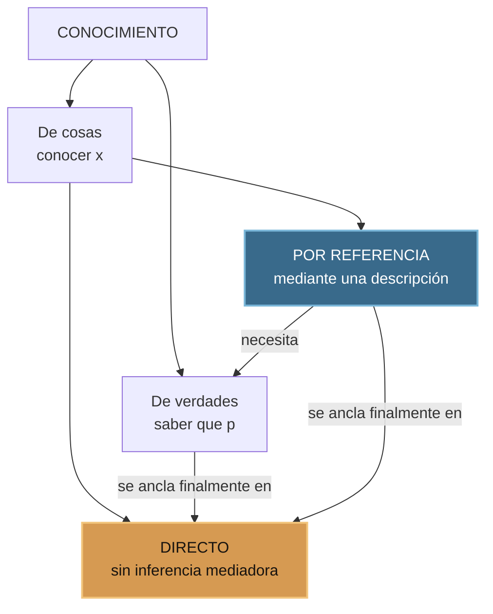
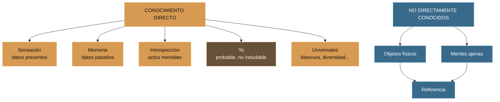
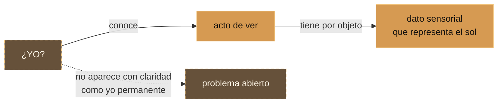
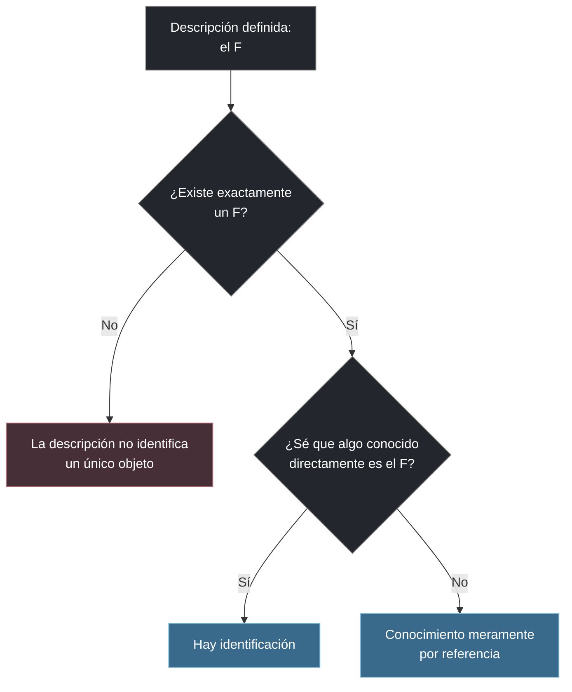
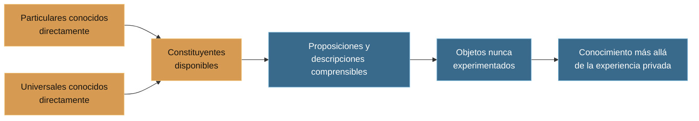

# Lo que conocemos y lo que podemos describir

## Exposición del capítulo 5 de *Los problemas de la filosofía*

> **Pregunta de apertura:** cuando digo «conozco esta mesa», ¿conozco la mesa misma o conozco colores, formas y resistencias a partir de los cuales la describo?

Esta exposición reconstruye la distinción de Bertrand Russell entre **conocimiento directo** y **conocimiento por referencia**. Su idea central es doble:

1. todo lo que comprendemos debe estar anclado, en último término, en algo conocido directamente;
2. las descripciones nos permiten ir mucho más allá de aquello que hemos experimentado personalmente.

El resultado parece paradójico: nuestra experiencia inmediata es muy estrecha, pero precisamente porque podemos organizarla mediante conceptos, relaciones y descripciones somos capaces de hablar con sentido sobre mesas físicas, otras mentes, personajes históricos y lugares que nunca hemos visitado.

---

## 1. Ficha de la exposición

| Elemento | Contenido |
|---|---|
| Texto base | Bertrand Russell, *Los problemas de la filosofía*, capítulo 5 |
| Edición | Editorial Labor, 1995; traducción de Joaquín Xirau |
| Núcleo del capítulo | Conocimiento de cosas: directo y por referencia |
| Pregunta guía | ¿Cómo conocemos cosas que nunca se presentan directamente ante nosotros? |
| Tesis | La referencia amplía el conocimiento, pero solo puede hacerlo desde elementos previamente conocidos de manera directa |
| Duración sugerida | 25–30 minutos, más 10 minutos de discusión |
| Apoyo principal | Mesa, candidato ganador, Bismarck, Julio César y el hombre de la máscara de hierro |

**Referencia bibliográfica:** Russell, Bertrand. *Los problemas de la filosofía*. Traducción de Joaquín Xirau. Barcelona: Editorial Labor, 1995, capítulo 5. La transcripción de trabajo y el PDF permanecen fuera del repositorio público.

> **Nota terminológica:** la edición de 1995 utiliza «conocimiento por referencia» y también aclara «descripción o referencia». En la bibliografía sobre Russell suele aparecer como *knowledge by description*. Aquí conservamos el vocabulario de la edición estudiada.

---

## 2. Objetivos de aprendizaje

Al terminar la exposición, el público podrá:

- distinguir **conocimiento de cosas** y **conocimiento de verdades**;
- explicar la diferencia entre conocimiento **directo** y **por referencia**;
- identificar qué objetos considera Russell directamente conocidos;
- reconstruir el paso de los datos sensoriales a la mesa física;
- explicar por qué una descripción definida exige **existencia y unicidad**;
- mostrar cómo cambia el contenido de un nombre propio según quien lo utiliza;
- exponer el principio fundamental del capítulo;
- evaluar las cautelas de Russell acerca de la memoria, el yo, los animales y los universales.

---

## 3. La arquitectura general del conocimiento

Russell parte de una distinción formulada al final del capítulo anterior:

- **conocimiento de verdades:** saber que algo es el caso;
- **conocimiento de cosas:** estar relacionado cognitivamente con una cosa.

El capítulo 5 se concentra en el segundo y lo divide nuevamente:

La asimetría es importante:

- el conocimiento directo es **lógicamente independiente** de una inferencia;
- el conocimiento por referencia **siempre implica verdades** que conectan la descripción con aquello que conocemos directamente.

Russell no sostiene que en la vida psicológica tengamos sensaciones completamente aisladas de cualquier pensamiento. Su afirmación es lógica: para que algo sea conocido directamente no necesita ser demostrado a partir de otra proposición.

---

## 4. Conocimiento directo: presencia sin intermediario

Russell define el conocimiento directo como el acceso a algo:

> «sin el intermediario de ningún proceso de inferencia ni de ningún conocimiento de verdades».

El ejemplo es un matiz visible de la mesa. Cuando veo el color:

- el matiz está presente;
- puedo conocerlo antes de clasificarlo;
- decir «es castaño» o «es oscuro» añade **verdades sobre** el color;
- esas verdades no hacen que el color mismo esté más presente.

### Lo directo no es una proposición verdadera o falsa

Russell afirma que el color presentado se conoce «de un modo perfecto y completo» y que los datos sensoriales son conocidos «exactamente como son». Eso no equivale a poseer todas las verdades acerca del color. El conocimiento directo es una **relación con el objeto**, no una proposición que pueda evaluarse como verdadera o falsa; la verdad y el error aparecen cuando formulamos juicios acerca de lo presentado.

| No significa | Sí significa en el capítulo |
|---|---|
| que conozcamos todas sus propiedades | que no llegamos a él mediante una inferencia |
| que el contacto sea ya un juicio verdadero | que el objeto está inmediatamente presentado |
| que toda afirmación posterior sea infalible | que el acceso lógico no depende de una proposición previa |
| que solo intervengan los cinco sentidos | que también pueden presentarse recuerdos, actos mentales y universales |

La fórmula útil para la exposición es:

> **Conocer una cosa directamente no es lo mismo que conocer muchas verdades sobre ella.**

---

## 5. La mesa: el experimento epistemológico

Frente a una mesa, Russell separa dos niveles.

### Nivel 1 — lo que se presenta

- color;
- forma aparente;
- dureza o suavidad;
- resistencia al tacto;
- variaciones de perspectiva.

Estos son **datos de los sentidos** conocidos directamente.

### Nivel 2 — aquello que suponemos que los causa

La mesa física se introduce mediante una descripción:

> «el objeto físico que causa tales y cuales datos de los sentidos».

Por eso la mesa física no está dada de la misma manera que el color. Llegamos a ella mediante una verdad puente: *estos datos son causados por un objeto físico*.

### Lo que Russell no está diciendo

Russell **no niega** en este capítulo que la mesa exista. Sostiene algo más preciso: la mesa, entendida como objeto físico independiente, no es conocida directamente. Lo que se presenta son datos sensoriales; el objeto físico es conocido como la entidad que los explica.

---

## 6. ¿Qué podemos conocer directamente?

Si solo conociéramos el dato sensorial presente, quedaríamos encerrados en un instante sin pasado, sin vida mental inteligible y sin conceptos generales. Russell amplía el inventario.

### 6.1 Sensación

Es el caso más evidente: los datos presentes de la vista, el tacto, el oído y los demás sentidos.

### 6.2 Memoria

El recuerdo hace presente algo que fue dado anteriormente. Para Russell, este conocimiento inmediato de la memoria es la fuente de todo conocimiento del pasado. Si no recordáramos nada, ni siquiera sabríamos que hay un pasado del cual inferir algo.

**Cautela:** que la memoria sea una fuente inmediata no implica que cada recuerdo sea verdadero. El capítulo describe su función fundante; no ofrece una teoría completa del error de memoria.

### 6.3 Introspección

No solo vemos el sol; también podemos darnos cuenta de **nuestro acto de verlo**. De igual modo podemos ser conscientes de:

- un deseo de alimento;
- placer o dolor;
- un pensamiento;
- un sentimiento;
- el acto de recordar o juzgar.

Esta autoconsciencia es la fuente del conocimiento de los objetos mentales propios.

### 6.4 El yo: probable, no seguro

Cuando intentamos encontrar el yo, encontramos pensamientos y sentimientos concretos, no necesariamente una persona permanente separada de ellos. Sin embargo, toda relación de conocimiento parece incluir:

1. algo conocido;
2. alguien que conoce;
3. una relación entre ambos.

Russell considera **probable**, pero no indudable, que tengamos algún conocimiento directo del sujeto que conoce.

### 6.5 Universales

También conocemos directamente universales o ideas generales: *blancura*, *diversidad*, *fraternidad*, relaciones y significados verbales. Russell llama:

- **concebir:** aprehender un universal;
- **concepto:** el universal aprehendido.

Sin universales no podríamos comprender una oración completa, porque al menos sus verbos expresan significados generales. El conocimiento directo no se limita, por tanto, a cosas particulares que existen en un lugar y un momento.

---

## 7. Conocimiento por referencia: saber cuál descripción se cumple

Una cosa es conocida por referencia cuando sabemos que existe **el objeto que satisface cierta descripción**, aunque el objeto mismo no nos sea presentado directamente.

Russell distingue:

- referencia ambigua: **«un F»**, por ejemplo, «un hombre»;
- referencia definida: **«el F»**, por ejemplo, «el hombre de la máscara de hierro».

El capítulo se concentra en la segunda.

### Existencia y unicidad

Decir «el F existe» equivale a afirmar:

1. existe al menos un objeto que es F;
2. no existe más de uno.

Una forma compacta de expresarlo es:

$$
\exists x\bigl(Fx \land \forall y(Fy \rightarrow y=x)\bigr)
$$

o, de manera abreviada, $\exists!x\,F(x)$: **existe exactamente un F**.

---

## 8. El candidato ganador: contacto no es identificación

Supongamos que conocemos personalmente a todos los candidatos de una elección. Uno de ellos obtendrá la mayoría de votos. Antes del resultado:

- conocemos a cada persona en el sentido ordinario posible para otra persona;
- sabemos que **exactamente uno** será «el candidato ganador»;
- todavía no sabemos qué individuo satisface esa descripción.

El ejemplo distingue dos relaciones:

| Relación | Pregunta |
|---|---|
| contacto o familiaridad con la persona | «¿He tratado con esta persona?» |
| identificación bajo una descripción | «¿Sé que esta persona es el ganador?» |

Podemos estar relacionados con el objeto sin conocerlo bajo cierta descripción; también podemos saber que la descripción tiene un único referente sin saber quién es.

### Ejemplo contemporáneo

«La persona que ganó anoche un concurso anónimo de programación» puede ser conocida por referencia antes de que se publique su nombre. Sabemos que existe una persona determinada y podemos conocer propiedades de ella, aunque no podamos identificarla.

---

## 9. Los nombres propios también esconden descripciones

Russell sostiene que los nombres propios ordinarios funcionan generalmente como descripciones abreviadas. El contenido asociado al nombre cambia según la perspectiva.

### El caso Bismarck

| Quién usa «Bismarck» | Qué puede tener en su pensamiento |
|---|---|
| Bismarck mismo | el sujeto que conoce como «yo», si existe conocimiento directo del yo |
| una persona que lo trató | datos sensoriales asociados a su cuerpo y conducta |
| un estudiante de historia | «el primer canciller del Imperio alemán», documentos y testimonios |

Las descripciones varían; el objeto al cual pretenden aplicarse permanece constante. Por eso dos personas pueden hablar del mismo Bismarck sin tener exactamente el mismo contenido mental.

Lo mismo ocurre con nombres de lugar como «Londres», «Alemania» o «la Tierra»: para que una descripción sea aplicable y no un mero juego verbal, debe enlazarse en algún punto con testimonios, imágenes, sonidos, mapas u otros elementos conocidos directamente.

---

## 10. Una escala de distancia epistemológica

Russell propone varios grados de alejamiento respecto de un particular:

1. **Bismarck respecto de sí mismo:** caso más cercano, si el yo es directamente conocido.
2. **Quien lo conoció personalmente:** tiene datos sensoriales vinculados con él.
3. **Quien lo conoce históricamente:** depende de documentos y testimonios.
4. **El hombre de la máscara de hierro:** sabemos datos, pero no su identidad.
5. **El hombre que ha vivido más tiempo:** solo sabemos lo que se deduce de la definición, si no podemos identificarlo.

La escala muestra que «conocer a alguien» no es una relación única. Podemos conocer más o menos sobre el referente y estar más o menos cerca de una presentación directa.

---

## 11. El principio fundamental del capítulo

Russell formula su tesis más fuerte así:

> **«Toda proposición que podamos entender debe estar compuesta exclusivamente por elementos de los cuales tengamos un conocimiento directo.»**

### El caso Julio César

Julio César no está presente en nuestro espíritu cuando juzgamos algo sobre él. Lo que aparece es una descripción como:

- «El hombre que fue asesinado en los Idus de marzo»;
- «el fundador del Imperio romano»;
- «el hombre cuyo nombre era *Julio César*».

Cada descripción está formada por particulares experimentados —sonidos, textos, imágenes— y universales comprendidos —*hombre*, *asesinar*, *fundar*, *imperio*—. Con esos elementos podemos comprender una proposición cuyo tema es un individuo jamás experimentado.

El principio intenta explicar a la vez:

- por qué nuestras palabras tienen significado;
- cómo podemos pensar en individuos ausentes;
- cómo el testimonio amplía el conocimiento;
- por qué la referencia debe conservar un anclaje en la experiencia.

---

## 12. La conclusión: anclaje y alcance

El movimiento total del capítulo puede resumirse en dos direcciones:

### Hacia abajo: el anclaje

Toda descripción comprensible debe descomponerse en elementos con los que tengamos alguna familiaridad directa: datos sensoriales, recuerdos, actos mentales y universales.

### Hacia afuera: el alcance

Una vez combinados esos elementos en verdades y descripciones, podemos conocer por referencia:

- objetos físicos;
- mentes ajenas;
- personas históricas;
- lugares nunca visitados;
- entidades cuya identidad todavía ignoramos.

> **La experiencia directa proporciona el vocabulario básico; la referencia construye con él un mundo que excede nuestra experiencia privada.**

---

## 13. Tabla comparativa final

| Aspecto | Conocimiento directo | Conocimiento por referencia |
|---|---|---|
| Forma | Presencia inmediata de un objeto | Identificación mediante «el F» |
| Inferencia | No es constitutiva | Es necesaria |
| Dependencia de verdades | Lógicamente independiente | Siempre implica alguna verdad |
| Ejemplo central | Color, dureza, acto de ver | Mesa física que causa esos datos |
| Objetos típicos | Sensaciones, recuerdos, actos mentales, universales | Objetos físicos, otras mentes, personajes históricos |
| Identidad | El objeto mismo está presentado | Puede saberse que existe sin saber quién o cuál es |
| Función | Fundamento | Extensión |
| Límite | Experiencia privada estrecha | Depende de descripciones verdaderas y bien ancladas |

---

## 14. Objeciones y cautelas para discutir

Estas preguntas no invalidan automáticamente el capítulo; muestran dónde se concentra la discusión filosófica.

### 14.1 ¿Puede una experiencia ser completamente «directa»?

Tal vez toda percepción humana ya esté organizada por conceptos, hábitos y expectativas. Russell distingue dependencia lógica de mezcla psicológica, pero queda abierta la relación entre ambas.

### 14.2 ¿Qué ocurre con los recuerdos falsos?

Si la memoria puede presentar algo que nunca ocurrió, debemos distinguir entre estar directamente relacionado con un contenido recordado y saber que ese contenido corresponde al pasado real.

### 14.3 ¿Conocemos el yo o solo estados mentales?

Russell no cierra la cuestión. Su conclusión es deliberadamente cauta: el yo es probable como término de la relación cognitiva, pero no aparece con la claridad de un color o un deseo.

### 14.4 ¿Existen universales como objetos?

La teoría presupone que podemos conocer universales. Un nominalista podría sostener que solo aprendemos usos de palabras; un conceptualista, que los universales son construcciones mentales. El capítulo anuncia una defensa posterior.

### 14.5 ¿Todo nombre equivale a una descripción?

Russell presenta esa tesis, pero no debe exponerse como consenso definitivo. Conviene distinguir la reconstrucción fiel del capítulo de una evaluación contemporánea de la teoría de los nombres.

### 14.6 ¿La referencia realmente rompe el encierro privado?

El conocimiento por referencia amplía el alcance, pero siempre parte de elementos experimentados por el sujeto. La pregunta crítica es si ese anclaje basta para garantizar que alcanzamos el mundo y no solo una red cada vez más compleja de descripciones.

---

## 15. Errores que debemos evitar al exponer

- **No** decir que Russell niega la existencia de la mesa.
- **No** equiparar conocimiento directo con certeza absoluta.
- **No** reducir lo directo a los cinco sentidos: incluye memoria, introspección y universales.
- **No** presentar el conocimiento del yo como indudable.
- **No** convertir la conjetura sobre la autoconsciencia animal en un hecho científico.
- **No** olvidar la unicidad: «el F» significa que existe exactamente un F.
- **No** suponer que todas las personas asocian la misma descripción con un nombre propio.
- **No** presentar la teoría descriptiva de los nombres como un consenso actual.
- **No** confundir conocer personalmente a alguien con saber que satisface cierta descripción.

---

## 16. Guion oral por diapositivas

El guion y la web comparten las mismas 14 diapositivas. Los tiempos indicados suman 25 minutos de exposición efectiva y dejan margen para transiciones y participación dentro de los 25–30 minutos previstos.

### Diapositiva 1 — La pregunta de la mesa · 1 min

**En pantalla:** «¿Conoces la mesa o conoces aquello que se te presenta?»

**Qué decir:** pedir al público que mire una mesa. Enumerar color, forma y resistencia. Preguntar cuál de esas cosas es *la mesa física*. No responder todavía.

### Diapositiva 2 — Portada y tesis · 1 min

**En pantalla:** «La arquitectura de lo ausente» y la fórmula «Directo = anclaje · Referencia = alcance».

**Qué decir:** presentar la tesis rectora: toda comprensión se ancla en algo conocido directamente, pero las descripciones permiten superar los límites de la experiencia privada.

### Diapositiva 3 — Dos formas de conocer · 2 min

**En pantalla:** mapa entre verdades, cosas, directo y referencia.

**Qué decir:** explicar que el capítulo no contrasta conocimiento verdadero y falso, sino dos maneras de conocer cosas. Lo directo funda; la referencia amplía.

### Diapositiva 4 — El color está presente · 1,5 min

**En pantalla:** matiz → «castaño» → «oscuro».

**Qué decir:** el matiz puede estar presente antes de que formulemos verdades sobre él. Clasificarlo añade conocimiento proposicional, no más presencia del color.

### Diapositiva 5 — De la apariencia al objeto · 2 min

**En pantalla:** cadena sensaciones → verdad puente → mesa física.

**Qué decir:** Russell no destruye la mesa; cambia su estatuto epistemológico. La mesa es aquello descrito como causa de los datos.

### Diapositiva 6 — El inventario de lo directo · 2 min

**En pantalla:** sensación, memoria, introspección, yo probable, universales.

**Qué decir:** sin memoria no habría pasado; sin introspección no conoceríamos nuestra vida mental; sin universales no comprenderíamos oraciones.

### Diapositiva 7 — El problema del yo · 2 min

**En pantalla:** sujeto → acto → objeto.

**Qué decir:** cuando miro hacia dentro encuentro pensamientos concretos. La relación cognitiva parece exigir un sujeto, pero Russell no afirma un yo permanente con certeza.

### Diapositiva 8 — Los universales · 1,5 min

**En pantalla:** blancura, diversidad y fraternidad alrededor de «universal».

**Qué decir:** toda oración completa necesita al menos un término general. *Concebir* es aprehender un universal; el universal aprehendido es un *concepto*.

### Diapositiva 9 — ¿Qué es «el F»? · 2 min

**En pantalla:** $\exists!x\,F(x)$.

**Qué decir:** una descripción definida no se limita a atribuir una propiedad; afirma existencia y unicidad. Usar «el hombre de la máscara de hierro».

### Diapositiva 10 — El ganador todavía desconocido · 1,5 min

**En pantalla:** candidatos conocidos / ganador no identificado.

**Qué decir:** se puede conocer a todas las personas y no saber cuál es el ganador. Contacto e identificación son relaciones diferentes.

### Diapositiva 11 — Bismarck y la distancia epistemológica · 2,5 min

**En pantalla:** escala entre presentación y descripción: sí mismo / conocido / historia / máscara / hombre más longevo.

**Qué decir:** el nombre conserva su referente, pero no el mismo contenido mental. Para el historiador, Bismarck llega a través de descripciones y testimonios. La escala muestra grados según el acceso y la información disponible.

### Diapositiva 12 — El principio fundamental · 2 min

**En pantalla:** la frase central del capítulo.

**Qué decir:** para comprender una proposición debemos comprender sus elementos. Julio César puede estar ausente porque lo sustituye una descripción formada con particulares y universales conocidos.

### Diapositiva 13 — Objeciones · 2,5 min

**En pantalla:** memoria, yo, universales, nombres.

**Qué decir:** distinguir claramente qué afirma Russell, qué deja en duda y qué puede discutirse. La cautela fortalece la exposición.

### Diapositiva 14 — Respuesta final · 1,5 min

**En pantalla:** «Directo = anclaje · Referencia = alcance».

**Qué decir:** volver a la mesa. No la conocemos de la misma manera que su color, pero podemos conocerla como el objeto físico que explica una experiencia organizada.

---

## 17. Preguntas para el público

### Comprensión

1. ¿Por qué decir que un color es castaño no mejora el conocimiento directo del color?
2. ¿Cuál es la verdad puente entre los datos de los sentidos y la mesa física?
3. ¿Qué hace posible la memoria dentro del sistema de Russell?
4. ¿En qué se diferencia la introspección del conocimiento del yo?
5. ¿Por qué incluye Russell los universales entre lo directamente conocido?
6. ¿Qué dos condiciones contiene la expresión «el F existe»?

### Aplicación

7. Si conocemos a todos los candidatos, ¿conocemos ya «al ganador»?
8. ¿Cómo conocemos una ciudad que nunca hemos visitado?
9. ¿Qué descripción asocias tú con el nombre «Bertrand Russell»?
10. Propón un caso actual en el que sepamos que alguien existe sin saber quién es.
11. ¿Qué elementos directamente conocidos intervienen al comprender una noticia sobre una persona nunca vista?

### Discusión crítica

12. ¿Puede una memoria falsa ser conocimiento directo de algo?
13. ¿Existe percepción humana sin conceptos?
14. ¿La relación entre sujeto y objeto demuestra que conocemos al sujeto?
15. ¿Puede un nombre conservar su referente aunque nuestras descripciones sean equivocadas?
16. ¿La referencia nos conecta con el mundo o solo con más descripciones?

---

## 18. Glosario mínimo

| Término | Definición para la exposición |
|---|---|
| Conocimiento de cosas | Relación cognitiva con un objeto particular o universal |
| Conocimiento de verdades | Saber que una proposición es el caso |
| Conocimiento directo | Acceso a un objeto sin inferencia constitutiva |
| Conocimiento por referencia | Conocimiento del único objeto que satisface una descripción |
| Dato de los sentidos | Color, sonido, dureza u otro contenido presentado |
| Objeto físico | Entidad descrita como causa de ciertos datos sensoriales |
| Introspección | Conocimiento directo de acontecimientos mentales propios |
| Autoconsciencia | Consciencia de pensamientos, sentimientos y actos propios |
| Universal | Entidad general como blancura, diversidad o una relación |
| Particular | Objeto individual |
| Concebir | Aprehender un universal |
| Descripción definida | Expresión singular de la forma «el F» |
| Unicidad | Condición de que solo un objeto satisfaga F |
| Experiencia privada | Conjunto limitado de objetos directamente accesibles a un sujeto |

---

## 19. Cierre para memorizar

> No conocemos directamente todo aquello sobre lo que podemos pensar. Conocemos directamente los elementos básicos de nuestra experiencia y, mediante verdades y descripciones, alcanzamos objetos ausentes. La referencia no reemplaza el contacto con el mundo: lo presupone y lo extiende.

En una fórmula:

$$
\text{conocimiento directo} = \text{anclaje}
\qquad
\text{conocimiento por referencia} = \text{alcance}
$$

---

## Fuente

Russell, Bertrand. *Los problemas de la filosofía*. Traducción de Joaquín Xirau; prólogo de Emilio Lledó. Barcelona: Editorial Labor, 1995. Capítulo 5, «Conocimiento directo y conocimiento por referencia».

La exposición es una reconstrucción pedagógica del capítulo. Las objeciones están señaladas como discusión y no se atribuyen a Russell como conclusiones del texto.
